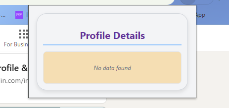

# LinkedIn Profile Hunter Chrome Extension

## Setup

1. Clone or unzip the extension folder.
2. Add your Hunter.io API key in popup.js (replace the placeholder).
3. Open Chrome and go to `chrome://extensions/`.
4. Enable "Developer mode" (toggle top right).
5. Click "Load unpacked" and select the extension folder.
6. The extension icon appears in the toolbar.

## Usage

1. Go to a LinkedIn profile page like https://www.linkedin.com/in/user-profile
2. Click the extension icon.
3. The popup will show Full Name, Email (from Hunter), Organisation, and Designation.
4. If no email found by Hunter.io, "No data found" message will be shown.

---

## Notes

- The extension uses Hunter.io's People API to find email addresses based on the LinkedIn profile handle.
- Full name, email, organization, and designation are retrieved from the API response.
- The API key is hardcoded in popup.js for simplicity.
